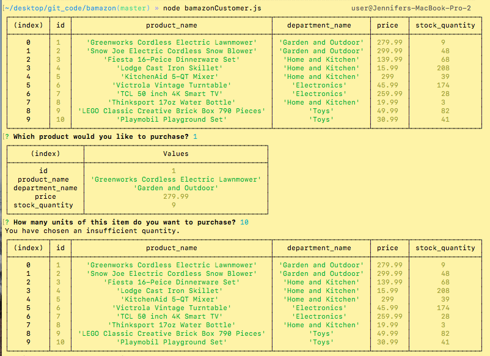

# Bamazon

Bamazon storefront using MySQL and Node.js 

## Description

Bamazon storefront allows the user to select an item to purchase, select the quantity of that item, and then reduces the stock quantity value of that item by the number the customer input. 

Purchasing a product, having the stock quantity reduced by amount purchased, and given a total cost of purchase.

This gif shows what happens when the user tries to purchase a product that does not exist, or order too much of a product.

## Built With

* Javascript
* MySQL
* Node.js